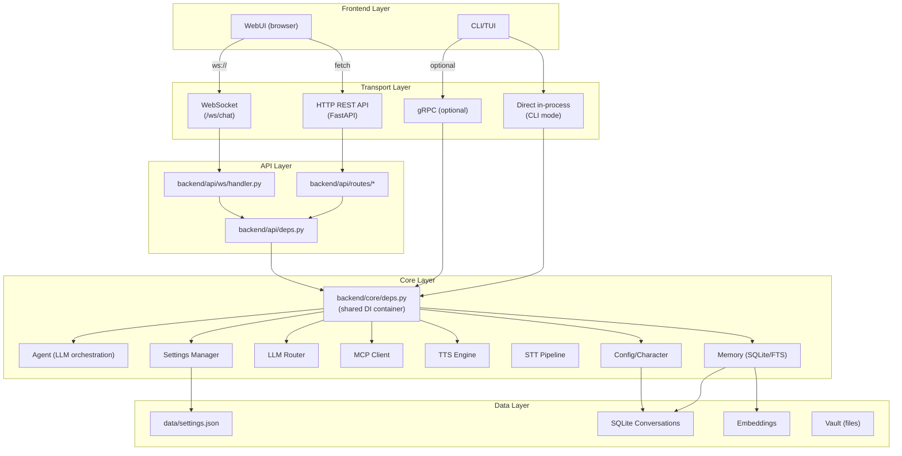

# Amalgam Backend Architecture Audit Report

**Date:** 2026-06-21
**Auditor:** Jcode Agent
**Project:** Amalgam (Voice-first AI Companion)
**Location:** `/home/leonardo/Workplace/k/`

---

## Executive Summary

The Amalgam project has a **well-structured backend architecture** with clear separation between frontend (WebUI) and backend layers. The backend uses a shared dependency injection container (`backend/core/deps.py`) that is consumed by both the CLI and the WebUI's FastAPI server. There are **no critical separation violations**. A few medium-priority issues exist around duplicated configuration data across layers and some frontend code that could benefit from being served dynamically.

**Separation Score: 7/10**

---

## Architecture Diagram

---

## 1. Backend/Frontend Separation Analysis

### 1.1 Import Boundary Audit

| Direction | Finding | Status |
|-----------|---------|--------|
| Backend → WebUI imports | Zero instances of `from webui` in any backend Python file | **CLEAN** |
| WebUI → Backend imports | Zero instances of `import backend` in any frontend JS file | **CLEAN** |
| API key exposure in frontend | API keys are only referenced in settings schema definitions (field metadata), never as literal values. Keys are always sent to backend via REST endpoints (`/api/settings/set`, `/api/setup/step1`) | **CLEAN** |

### 1.2 Data Flow Verification

The WebUI communicates with the backend exclusively through:
- **REST endpoints** (`/api/*`) via `fetch()` through the `api-client.js` wrapper
- **WebSocket** (`/ws/chat`) for real-time chat streaming

No frontend code directly imports or calls Python backend modules.

### 1.3 Business Logic Location

| Concern | Location | Assessment |
|---------|----------|------------|
| LLM calls | `backend/core/llm/` | **CORRECT** - No LLM calls from frontend |
| File I/O | Backend only | **CORRECT** - Frontend uses only browser-native `FileReader` for image attachments (sent to backend as base64) |
| Settings persistence | `backend/core/config/settings.py` | **CORRECT** - Frontend sends settings changes via REST, backend persists |
| Voice processing (server-side STT/TTS) | `backend/voice/`, `backend/core/voice/` | **CORRECT** - Server-side voice processing in backend |
| Voice input (browser STT) | `webui/js/modules/voice.js` | **ACCEPTABLE** - Uses browser's native SpeechRecognition API as one STT option; results sent to backend via WS |
| Companion idle detection | `webui/js/modules/companion.js` | **MINOR CONCERN** - Frontend detects user idle state and sends `idle_enter`/`idle_exit` events to backend. This is acceptable as a thin UI signal layer, but the backend also has its own `CompanionScheduler`. |

---

## 2. WebUI vs CLI Backend Sharing

### 2.1 Architecture Comparison

| Aspect | WebUI | CLI/TUI |
|--------|-------|---------|
| **Entry point** | `main.py webui` → uvicorn → `backend.app:app` | `main.py cli` → `cli/__init__.py` |
| **Backend init** | `backend.core.startup.init_application()` via FastAPI startup event | Same: `backend.core.startup.init_application()` called directly |
| **DI container** | `backend.core.deps.get_shared()` (same singleton dict) | Same: `backend.core.deps.get_shared()` |
| **Agent** | Same `Agent` instance via DI | Same `Agent` instance via DI |
| **Memory** | Same `Memory` instance via DI | Same `Memory` instance via DI |
| **LLM** | Same `LLMRouter` instance via DI | Same `LLMRouter` instance via DI |
| **MCP** | Same `MCPClient` instance via DI | Same `MCPClient` instance via DI |
| **TTS** | Same `TTS` instance via DI | Same `TTS` instance via DI |
| **Settings** | Same `Settings` instance via DI | Same `Settings` instance via DI |
| **Chat protocol** | WebSocket JSON messages (`/ws/chat`) | Direct `agent.handle_user_input()` async generator iteration |
| **Auth** | No authentication (CORS-restricted) | No authentication |
| **REST endpoints** | Full REST API via FastAPI routes | Not used (direct function calls) |

### 2.2 Key Shared Components

Both frontends share these exact same backend components through `backend/core/deps.py`:

- `Settings` - Configuration management
- `LLMRouter` - LLM provider routing
- `Memory` - Conversation memory (SQLite + FTS)
- `Agent` - Agent orchestration (basic/reflective/planning modes)
- `MCPClient` - Model Context Protocol client
- `TTS` - Text-to-speech engine
- `Relationship` - Character relationship tracking
- `Orchestrator` - Multi-agent orchestration

### 2.3 Protocol Differences

| Feature | WebUI | CLI/TUI |
|---------|-------|---------|
| Chat messages | WebSocket JSON: `{type: "user_message", text: "..."}` | Direct async iteration of `agent.handle_user_input(text)` |
| Streaming tokens | WS: `{type: "chat_append", role: "assistant", text: "..."}` | Tuple tags: `("__thinking__", "...")`, direct string chunks |
| Tool calls | WS: `{type: "tool_call", text: "..."}` | Tuple: `("__tool__", "...")` |
| Errors | WS: `{type: "chat_append", ..., error: true}` | Tuple: `("__error__", "...")` |
| TTS audio | WS: `{type: "tts_audio", audio: "<base64>"}` | N/A (text-only terminal) |
| Emotion/avatar | WS: `{type: "emotion", emotion: "..."}` | Tuple: `("__emotion__", "...")` |
| Session management | REST: `/api/memory/*` endpoints | Direct `memory.get_sessions()`, `memory.start_session()` |
| Settings | REST: `/api/settings`, `/api/settings/set` | Direct `settings.get()`, `settings.set()` |
| Health | REST: `/api/health` | Direct `health.get_registry().check_all()` |
| Commands | WS: `{type: "slash_command", command: "..."}` | Direct string parsing in CLI loop |

### 2.4 Assessment

**The WebUI and CLI share the same backend core.** The primary difference is transport:
- WebUI goes through HTTP/WebSocket → FastAPI routes → DI container
- CLI/TUI goes directly → DI container

This is a clean design pattern. The CLI acts as a "thin client" that calls the same core functions that the REST API wraps.

---

## 3. Wrong-Layer Code Analysis

### 3.1 Settings Hardcoded in Frontend

**Status: MINOR ISSUE**

The file `webui/js/modules/settings-schema.js` contains:
- `PROVIDER_DISPLAY_NAMES` - Provider display names (18 providers)
- `PROVIDER_MODELS` - Default model lists per provider
- `SETTINGS_SCHEMA` - Full settings form definitions

These are also defined in `cli/provider.py` (`KNOWN_PROVIDERS`, `PROVIDER_MODELS`) and `backend/core/config/settings.py` (`DEFAULTS`).

**Impact**: When a new provider or model is added, it must be updated in 3 places. This is a maintenance concern, not a security issue, since these are display/fallback values only.

**Recommendation**: Consider having the backend serve the provider/model list via `/api/providers` (which it already does) and have the frontend fetch this at startup instead of hardcoding.

### 3.2 Voice Processing Location

**Status: ACCEPTABLE**

- **Browser STT** (`webui/js/modules/voice.js`): Uses the browser's native Web Speech API. This is a legitimate frontend capability - the browser does the speech recognition and sends text to the backend via WebSocket. The backend also has server-side STT options (`faster-whisper`, `openai-whisper`, `groq-whisper`) configured via settings.
- **Server-side TTS** (`backend/core/voice/tts/`): All TTS runs on the backend and sends audio to the frontend via WebSocket. Correct.
- **Voice pipeline state machine** (`backend/voice/pipeline.py`): Properly in backend. Manages STT→LLM→TTS flow.

### 3.3 LLM Calls from Frontend

**Status: CLEAN**

Zero instances of direct LLM API calls from frontend JavaScript. All LLM interaction flows through:
- WebUI: Frontend → WebSocket → `handler.py` → `agent.handle_user_input()` → `LLMRouter`
- CLI: CLI → `agent.handle_user_input()` → `LLMRouter`

### 3.4 File I/O from Frontend

**Status: CLEAN**

The only frontend file I/O is `FileReader` for image attachments (browser-native), which are sent as base64 to the backend. All persistent file I/O (settings, conversations, vault) is backend-only.

### 3.5 Duplicate Logic Between Backend Modules

**Status: MINOR ISSUE**

- Provider/model lists exist in 3 places: `backend/core/config/settings.py` (DEFAULTS), `cli/provider.py` (KNOWN_PROVIDERS, PROVIDER_MODELS), `webui/js/modules/settings-schema.js` (PROVIDER_DISPLAY_NAMES, PROVIDER_MODELS).
- Settings validation exists in both `backend/api/routes/settings.py` (`_validate_settings_update()`) and frontend `settings-schema.js` (field-level conditional display logic).
- The health check registry is used identically by CLI and WebUI through the same `backend.core.health` module.

---

## 4. Issues Found

### CRITICAL Issues

*None found.*

### HIGH Issues

*None found.*

### MEDIUM Issues

| ID | Issue | Location | Description |
|----|-------|----------|-------------|
| M1 | **Duplicated provider/model configuration** | `cli/provider.py`, `settings-schema.js`, `settings.py` | Provider names and default model lists are duplicated in 3 locations. A single source of truth (backend) should be fetched dynamically. |
| M2 | **TUI accesses backend.core.paths directly** | `cli/tui.py:1218,1682` | The TUI imports `CHARACTERS_DIR` directly from `backend.core.paths` for character listing. While functional, this bypasses the DI layer. |
| M3 | **TUI calls backend health/metrics directly** | `cli/tui.py:1540,1636` | Direct imports of `get_registry()` and `get_collector()` bypass the DI singletons from `deps.py`. |
| M4 | **TUI imports settings switch_profile directly** | `cli/tui.py:1714` | `from backend.core.config.settings import switch_profile` bypasses the DI layer. |

### LOW Issues

| ID | Issue | Location | Description |
|----|-------|----------|-------------|
| L1 | **CLI imports cli.provider in TUI** | `cli/tui.py:1094,1147` | The TUI imports `KNOWN_PROVIDERS` and `PROVIDER_MODELS` from `cli.provider` for dropdown filtering, duplicating the provider knowledge that exists in the backend config. |
| L2 | **Frontend hardcoded localhost:8000** | `webui/js/modules/config.js:6,9` | `BASE_URL` is set to `http://localhost:8000` for Tauri mode. This is fine for local development but should be configurable. |
| L3 | **Frontend fetch calls use raw fetch for some endpoints** | `webui/js/modules/voice.js:143,166`, `webui/js/modules/settings.js:559` | Some settings persist calls use raw `fetch()` instead of the `api()` wrapper, losing timeout/abort behavior. |

---

## 5. Recommendations

### Priority 1: Centralize Provider/Model Configuration
Create a single backend endpoint (`/api/providers` already exists partially) that serves the canonical list of providers, their display names, and known models. Both the CLI and frontend should consume this. Eliminate the hardcoded lists in `cli/provider.py` and `settings-schema.js`.

### Priority 2: Route CLI/TUI Through DI Consistently
The TUI currently imports backend modules directly (`get_registry`, `get_collector`, `switch_profile`, `CHARACTERS_DIR`). These should go through the shared DI container in `backend/core/deps.py` for consistency and testability.

### Priority 3: Standardize Frontend API Calls
All frontend HTTP calls should go through the `api()` wrapper in `api-client.js` for consistent timeout, error handling, and abort support. Currently, some `fetch()` calls bypass this.

### Priority 4: Consider gRPC for CLI Remote Mode
The CLI already supports gRPC mode (`cli --grpc`). Consider making this the primary CLI mode for remote deployments, with the in-process mode as an optimization for local use.

---

## 6. Summary

The Amalgam project demonstrates a **well-designed backend architecture** with:
- Clean separation between frontend (WebUI, CLI, Telegram, Desktop) and backend core
- Shared DI container ensuring all frontends use the same singleton instances
- No business logic leaking into the frontend
- No API keys exposed in frontend code
- Proper use of WebSocket for real-time streaming and REST for CRUD operations
- Voice processing correctly split (browser STT as one option, server-side as primary)

The main area for improvement is **configuration deduplication** - provider/model lists should have a single source of truth in the backend that both CLI and frontend consume dynamically.
