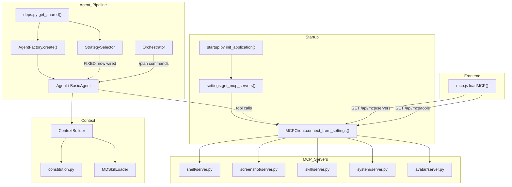

# MCP + Orchestrator + Skills Wiring Audit

**Date:** 2026-06-22  
**Repo:** `/home/leonardo/Workplace/k/backend`

---

## 1. MCP Subsystem

### Status: ✅ Wired correctly

| Component | Status | Notes |
|---|---|---|
| `MCPClient` initialization | ✅ | Singleton via `deps.get_shared()`, lazily created at `_shared["mcp"] = MCPClient()` |
| Server connections on startup | ✅ | `startup.init_application()` calls `mcp_client.connect_from_settings(mcp_servers)` |
| Settings reload | ✅ | `make_settings_reloader()` reconnects MCP servers on config changes |
| MCP routes registered | ✅ | `app.include_router(mcp_route.router)` in `app.py` line 175 |
| All MCP server files exist | ✅ | `shell`, `screenshot`, `skill`, `system`, `avatar` — all present |
| Default server configs | ✅ | `settings.py` lines 308-378 defines all server configs with `"skill"` enabled |
| Frontend MCP display | ✅ | `loadMCP()` called from `app.js:218` when settings tab activated |

### Issues found

- **Cosmetic:** `backend/api/routes/mcp.py` decorators have unusual spacing: `@router .get (` instead of `@router.get(`. This works in Python but is non-idiomatic.
- **No denylist MCP route** — only `GET /api/mcp/servers`, `POST /api/mcp/servers`, `GET /api/mcp/tools`, `POST /api/shell/approve` exist.

---

## 2. Orchestrator Subsystem

### Status: ✅ Wired correctly

| Component | Status | Notes |
|---|---|---|
| `Orchestrator` class exists | ✅ | `backend/core/orchestrator/engine.py` — full plan/task lifecycle |
| Instantiated in `deps.py` | ✅ | `_shared["orchestrator"] = Orchestrator(config=_shared["settings"])` |
| Imported in WS handler | ✅ | `from backend.core.orchestrator import AgentProtocol` |
| Used in WS handler | ✅ | `/plan create`, `/plan list`, `/plan status`, `/plan run`, `/plan cancel` slash commands at lines 922-999 |
| `_OrchestratorAgentAdapter` | ✅ | Adapts app Agent to `AgentProtocol` at lines 97-117 |
| Plan persistence | ✅ | `save_state()` / `load_state()` to `data/orchestrator_state.json` |
| Swarm UI update | ✅ | `emit_swarm_update()` via `set_ws_sender()` |

### Issues found

- None. Orchestrator is fully integrated and used.

---

## 3. Metacognitive Subsystem

### Status: ✅ StrategySelector wired, MetaCognitiveEngine unused as facade

| Component | Status | Notes |
|---|---|---|
| `StrategySelector` class | ✅ | `backend/core/metacognitive/strategy_selector.py` |
| Instantiated in `deps.py` | ✅ | `_shared["strategy_selector"] = StrategySelector()` |
| Passed to `Agent` (fallback path) | ✅ | `strategy_selector=_shared["strategy_selector"]` in `deps.py:121` |
| Passed to `AgentFactory` (primary path) | ✅ | **FIXED** — now passes `strategy_selector=_shared["strategy_selector"]` |
| Used in `Agent.core.handle_user_input` | ✅ | Lines 249-252 — selects strategy for intent |
| `BasicAgent._classify_intent` | ✅ | **ADDED** — static method, used in `run()` |
| `StrategySelector.select()` called from `BasicAgent.run()` | ✅ | **FIXED** — now calls `_classify_intent` and `strategy_selector.select()` |
| `PlanningAgent` accepts `strategy_selector` | ✅ | **FIXED** — constructor now takes `strategy_selector` param |
| `MetaCognitiveEngine` class | ✅ | Exists as optional facade, not directly imported elsewhere |

### Issues found (FIXED)

- **Wiring gap #1:** `AgentFactory.create()` did not accept `strategy_selector` param. The primary agent creation path (via `AgentFactory`) lost the strategy_selector. Only the fallback path (`except Exception` → bare `Agent()`) had it.  
  **Fix:** Added `strategy_selector` param to `AgentFactory.create()` and all three agent creation sites (`BasicAgent`, `PlanningAgent`).

- **Wiring gap #2:** `BasicAgent.__init__()` did not accept `strategy_selector` param.  
  **Fix:** Added `strategy_selector` param to `BasicAgent.__init__()` and stored it.

- **Wiring gap #3:** `BasicAgent.run()` used hardcoded `max_iterations = 5` instead of consulting the strategy selector.  
  **Fix:** Added `_classify_intent()` static method and strategy selection logic to `BasicAgent.run()`.

- **Wiring gap #4:** `PlanningAgent.__init__()` did not accept `strategy_selector` param.  
  **Fix:** Added `strategy_selector` param and all inner `BasicAgent()` instantiations pass it through.

- **Wiring gap #5:** `BaseAgent.spawn_subagent()` created a fresh `BasicAgent` without `strategy_selector`.  
  **Fix:** Now passes `strategy_selector=getattr(self, 'strategy_selector', None)`.

---

## 4. Skills System

### Status: ✅ Dual-path wiring works

| Component | Status | Notes |
|---|---|---|
| Skill MCP server (`backend/mcp/servers/skill/server.py`) | ✅ | Configured in settings, auto-started by MCPClient |
| `MDSkillLoader` (`backend/skills/md_loader.py`) | ✅ | Used by `context_builder._build_skills_for_query()` |
| `MDSkillLoader.get_loader()` singleton | ✅ | Module-level, lazily loaded |
| `setup_hot_reload` with `_get_skill_loader()` | ✅ | `app.py:276-278` — watches SKILL.md files |
| Skills injected into context | ✅ | `context_builder.py:164` calls `_build_skills_for_query(user_msg)` |
| `backend/skills/` directory | ✅ | Contains: `web_search`, `summarize_url`, `reminder`, `note`, `read_vault`, `create_skill` |

### Issues found

- None. Skills system has two complementary paths:
  1. **MCP Skill server** — provides tool-based access to create/list/load/delete SKILL.md files
  2. **MDSkillLoader** — loads all SKILL.md files at startup, matches by trigger keywords, injects relevant ones into context

---

## 5. Constitution

### Status: ✅ Wired correctly

| Component | Status | Notes |
|---|---|---|
| `constitution.md` file | ✅ | Exists at `data/constitution.md` (1218 bytes) |
| `load_constitution()` | ✅ | Returns cached content |
| `build_system_prompt()` | ✅ | Combines constitution + character soul |
| Used in `context_builder.py:300` | ✅ | `build_system_prompt(character_soul=identity_content, character_name=name)` |
| Hot-reload support | ✅ | `reload_cache()` called by `HotReloader` |
| Hot-reload wired in `app.py:278` | ✅ | `setup_hot_reload(_get_skill_loader(), constitution)` |

### Issues found

- None. Constitution is loaded, cached, and injected into every conversation's system prompt.

---

## 6. Frontend MCP UI

### Status: ✅ Wired correctly

| Component | Status | Notes |
|---|---|---|
| `webui/js/modules/mcp.js` | ✅ | `loadMCP()` fetches servers + tools from API |
| Imported in `app.js:29` | ✅ | `import { loadMCP } from './modules/mcp.js'` |
| Called on settings tab | ✅ | `app.js:218` — `loadMCP()` triggered when settings tab activated |
| Toggle enabled/disabled | ✅ | Checkbox toggles send batch settings update |
| Tool cards rendered | ✅ | `tools-grid` populated with tool cards |

### Issues found

- None. Frontend correctly calls backend MCP API and renders servers/tools.

---

## Summary of Fixes Applied

1. **`backend/core/agent/factory.py`** — Added `strategy_selector` parameter to `AgentFactory.create()` and all agent creation calls.
2. **`backend/core/agent/basic_agent.py`** — Added `strategy_selector` param to `__init__()`, added `_classify_intent()` method, wired strategy selection into `run()`.
3. **`backend/core/agent/planning_agent.py`** — Added `strategy_selector` param to `__init__()`, passed through to all inner `BasicAgent()` calls.
4. **`backend/core/agent/base.py`** — `spawn_subagent()` now passes `strategy_selector` to spawned `BasicAgent`.
5. **`backend/core/deps.py`** — `AgentFactory.create()` call now passes `strategy_selector=_shared["strategy_selector"]`.

---

## Wiring Diagram

